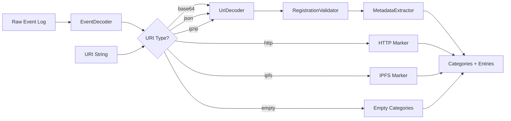

# erc8004-registry-parser

[]() 

Validator and parser for ERC-8004 Trustless Agent Registration Files. Validates against the spec, classifies URI types, decodes raw event logs, and extracts metadata with comprehensive error reporting.

---

## Description

ERC-8004 is the Ethereum standard for trustless AI agents (activated January 29, 2026). Agents register on-chain via NFT-based identity, linking to an off-chain Registration File (JSON) that contains metadata about the agent's capabilities.

In the real world, many agents deviate from the official specification:
- Using `"name"` instead of `"type"` in services
- Using `"endpoint"` instead of `"url"` for service URLs
- Using lowercase `"x402support"` instead of `"x402Support"`
- Missing required fields like `"type"` or `"description"`

This parser handles both spec-compliant and real-world Registration Files, providing detailed validation messages for every deviation.

### Architecture

The module processes ERC-8004 data through a comprehensive pipeline:



**Data Flow:**
1. **EventDecoder**: Decode raw Ethereum event logs (Registered/URIUpdated events)
2. **UriClassifier**: Classify URI type (empty, base64, HTTP, IPFS, JSON, gzip, unknown)
3. **UriDecoder**: Decode URI to JSON (base64, gzip, inline JSON)
4. **RegistrationValidator**: Validate against ERC-8004 spec (6 validation levels)
5. **MetadataExtractor**: Extract categories and structured entries
6. **External Validators**: Plugin system for MCP/A2A endpoint validation

**Pipeline Chain:**

```javascript
const { decodedAgentUri, agentId, ownerAddress } = Erc8004RegistryParser.decodeEventLog( { eventLog } )
const { uriAgentType }            = Erc8004RegistryParser.classifyUri( { decodedAgentUri } )
const { decodedRegistrationFile } = Erc8004RegistryParser.decodeUri( { decodedAgentUri, uriAgentType } )
const { categories, entries }     = Erc8004RegistryParser.categorizeRegistration( { decodedRegistrationFile } )
```

---

## Quickstart

Clone and install the module to validate ERC-8004 Registration Files.

```bash
git clone https://github.com/flowmcp/erc8004-registry-parser.git
cd erc8004-registry-parser
npm install
```

```javascript
import { Erc8004RegistryParser } from 'erc8004-registry-parser'

const uri = 'data:application/json;base64,eyJuYW1lIjoiVGVzdCBBZ2VudCIsImRlc2NyaXB0aW9uIjoiQSB0ZXN0IGFnZW50IiwidHlwZSI6Imh0dHBzOi8vZWlwcy5ldGhlcmV1bS5vcmcvRUlQUy9laXAtODAwNCNyZWdpc3RyYXRpb24tdjEiLCJzZXJ2aWNlcyI6W3sidHlwZSI6Im1jcCIsInVybCI6Imh0dHBzOi8vbWNwLmV4YW1wbGUuY29tIn1dLCJ4NDAyU3VwcG9ydCI6dHJ1ZSwiYWN0aXZlIjp0cnVlfQ=='

const result = Erc8004RegistryParser.validateFromUri( { agentUri: uri } )

console.log( result['status'] )           // true
console.log( result['messages'] )         // []
console.log( result['categories']['isSpecCompliant'] )  // true
console.log( result['entries']['name'] )  // "Test Agent"
console.log( result['entries']['mcpEndpoint'] )  // "https://mcp.example.com"
```

---

## Features

- **Validates ERC-8004 Registration Files** against the official specification
- **Classifies URI types** (empty, base64, HTTP, IPFS, JSON, gzip, unknown)
- **Decodes raw Ethereum event logs** (Registered and URIUpdated events)
- **Extracts metadata** (name, description, services, x402Support, etc.)
- **Comprehensive error reporting** with specific validation messages
- **Detects spec deviations** ("name" vs "type", "endpoint" vs "url", etc.)
- **Plugin system** for external MCP/A2A endpoint validators
- **Handles real-world edge cases** (53.5% of agents use empty URIs)
- **Built on ethers v6** for ABI decoding and address validation

---

## Table of Contents

- [Methods](#methods)
    - [.start()](#start)
    - [.validateFromUri()](#validatefromuri)
    - [.decodeEventLog()](#decodeeventlog)
    - [.classifyUri()](#classifyuri)
    - [.decodeUri()](#decodeuri)
    - [.categorizeRegistration()](#categorizeregistration)
- [Validator Interface](#validator-interface)
- [URI Types](#uri-types)
- [Validation Rules](#validation-rules)
- [Output Shape](#output-shape)
- [Contribution](#contribution)
- [License](#license)

---

## Methods

All public methods are static and follow a consistent output format. Every method returns an object with `status`, `messages`, and additional fields depending on the operation.

---

### .start()

Full validation pipeline starting from a raw Ethereum event log. Decodes the log, classifies the URI, validates the Registration File, and extracts metadata.

**Method**

```javascript
.start( { eventLog, additionalValidators } )
```

**Parameters**

| Key | Type | Description | Required |
|-----|------|-------------|----------|
| eventLog | object | Raw Ethereum event log with `topics` and `data` fields | Yes |
| additionalValidators | object | External validators for MCP/A2A endpoints (see [Validator Interface](#validator-interface)) | No |

**Example**

```javascript
const eventLog = {
    topics: [
        '0xca52e62c367d81bb2e328eb795f7c7ba24afb478408a26c0e201d155c449bc4a',
        '0x000000000000000000000000000000000000000000000000000000000000002a',
        '0x0000000000000000000000008ec6c9a8a6b0d69f48734c4b7ecd1cbb190a0d69'
    ],
    data: '0x0000...0000'
}

const result = Erc8004RegistryParser.start( { eventLog } )
```

**Returns**

```javascript
returns { status, messages, categories, entries }
```

| Key | Type | Description |
|-----|------|-------------|
| status | boolean | `true` if validation passed with no errors, `false` otherwise |
| messages | array of strings | Validation error/warning messages (empty if status is true) |
| categories | object | Boolean flags for URI type, spec compliance, protocols, etc. (see [Output Shape](#output-shape)) |
| entries | object | Extracted metadata fields (name, description, services, etc.) |

---

### .validateFromUri()

Full validation pipeline starting from a URI string. Validates the Registration File against the ERC-8004 spec and extracts metadata.

**Method**

```javascript
.validateFromUri( { agentUri, agentId, ownerAddress, additionalValidators } )
```

**Parameters**

| Key | Type | Description | Required |
|-----|------|-------------|----------|
| agentUri | string | Agent Registration File URI (base64, HTTP, IPFS, JSON, etc.) | Yes |
| agentId | string | Agent ID (for metadata extraction, optional) | No |
| ownerAddress | string | Owner address (for metadata extraction, optional) | No |
| additionalValidators | object | External validators for MCP/A2A endpoints (see [Validator Interface](#validator-interface)) | No |

**Example**

```javascript
const uri = 'data:application/json;base64,eyJuYW1lIjoiVGVzdCJ9'

const result = Erc8004RegistryParser.validateFromUri( { agentUri: uri } )
console.log( result['status'] )  // false (missing required fields)
console.log( result['messages'] )  // [ 'type: Missing required field...', 'description: Missing field' ]
```

**Returns**

```javascript
returns { status, messages, categories, entries }
```

| Key | Type | Description |
|-----|------|-------------|
| status | boolean | `true` if validation passed with no errors, `false` otherwise |
| messages | array of strings | Validation error/warning messages (empty if status is true) |
| categories | object | Boolean flags for URI type, spec compliance, protocols, etc. (see [Output Shape](#output-shape)) |
| entries | object | Extracted metadata fields (name, description, services, etc.) |

---

### .decodeEventLog()

Decode a raw Ethereum event log to extract agentId, ownerAddress, and decodedAgentUri. Does not validate the Registration File content.

**Method**

```javascript
.decodeEventLog( { eventLog } )
```

**Parameters**

| Key | Type | Description | Required |
|-----|------|-------------|----------|
| eventLog | object | Raw Ethereum event log with `topics` and `data` fields | Yes |

**Example**

```javascript
const eventLog = {
    topics: [
        '0xca52e62c367d81bb2e328eb795f7c7ba24afb478408a26c0e201d155c449bc4a',
        '0x000000000000000000000000000000000000000000000000000000000000002a',
        '0x0000000000000000000000008ec6c9a8a6b0d69f48734c4b7ecd1cbb190a0d69'
    ],
    data: '0x0000...0000'
}

const result = Erc8004RegistryParser.decodeEventLog( { eventLog } )
console.log( result['agentId'] )          // "42"
console.log( result['ownerAddress'] )     // "0x8Ec6C9A8A6b0d69f48734c4b7Ecd1cbb190a0D69"
console.log( result['decodedAgentUri'] )  // "data:application/json;base64,..."
```

**Returns**

```javascript
returns { status, messages, agentId, ownerAddress, decodedAgentUri }
```

| Key | Type | Description |
|-----|------|-------------|
| status | boolean | `true` if decoding succeeded, `false` otherwise |
| messages | array of strings | Decoding error messages (e.g., invalid topics, ABI decoding failure) |
| agentId | string or null | Decoded agent ID (uint256 as string) |
| ownerAddress | string or null | Decoded owner address (checksummed) |
| decodedAgentUri | string or null | Decoded agent URI (may be empty string) |

---

### .classifyUri()

Classify a URI string into one of the supported types (empty, base64, HTTP, IPFS, JSON, gzip, unknown).

**Method**

```javascript
.classifyUri( { decodedAgentUri } )
```

**Parameters**

| Key | Type | Description | Required |
|-----|------|-------------|----------|
| decodedAgentUri | string | Agent Registration File URI | Yes |

**Example**

```javascript
const uris = [
    'data:application/json;base64,eyJ0ZXN0IjoiMSJ9',
    'https://myagent.com/.well-known/erc8004.json',
    'ipfs://QmYwAPJzv5CZsnA625s3Xf2nemtYgPpHdWEz79ojWnPbdG',
    '{"name":"Inline Agent"}',
    ''
]

uris.forEach( ( uri ) => {
    const result = Erc8004RegistryParser.classifyUri( { decodedAgentUri: uri } )
    console.log( result['uriAgentType'] )  // "base64", "http", "ipfs", "json", "empty"
} )
```

**Returns**

```javascript
returns { uriAgentType, categories }
```

| Key | Type | Description |
|-----|------|-------------|
| uriAgentType | string | One of: `"empty"`, `"base64"`, `"http"`, `"ipfs"`, `"json"`, `"gzip"`, `"unknown"` |
| categories | object | Partial categories object with URI type flags set (see [Output Shape](#output-shape)) |

---

### .decodeUri()

Decode a URI string to JSON. Supports base64, gzip, and inline JSON URIs. HTTP and IPFS URIs are not decoded (requires fetch/gateway).

**Method**

```javascript
.decodeUri( { decodedAgentUri, uriAgentType } )
```

**Parameters**

| Key | Type | Description | Required |
|-----|------|-------------|----------|
| decodedAgentUri | string | Agent Registration File URI | Yes |
| uriAgentType | string | Pre-classified URI type (if not provided, will auto-classify) | No |

**Example**

```javascript
const uri = 'data:application/json;base64,eyJuYW1lIjoiVGVzdCJ9'

const result = Erc8004RegistryParser.decodeUri( { decodedAgentUri: uri } )
console.log( result['status'] )                    // true
console.log( result['decodedRegistrationFile'] )   // { name: "Test" }
```

**Returns**

```javascript
returns { status, messages, decodedRegistrationFile }
```

| Key | Type | Description |
|-----|------|-------------|
| status | boolean | `true` if decoding succeeded, `false` otherwise |
| messages | array of strings | Decoding error messages (e.g., invalid base64, JSON parse failure) |
| decodedRegistrationFile | object or null | Parsed JSON object (null if decoding failed or URI type is not decodable) |

---

### .categorizeRegistration()

Extract metadata from a parsed JSON Registration File. Does not validate the JSON structure.

**Method**

```javascript
.categorizeRegistration( { decodedRegistrationFile } )
```

**Parameters**

| Key | Type | Description | Required |
|-----|------|-------------|----------|
| decodedRegistrationFile | object | Parsed Registration File JSON | Yes |

**Example**

```javascript
const decodedRegistrationFile = {
    name: 'Test Agent',
    description: 'A test agent',
    services: [ { type: 'mcp', url: 'https://mcp.example.com' } ],
    x402Support: true
}

const result = Erc8004RegistryParser.categorizeRegistration( { decodedRegistrationFile } )
console.log( result['categories']['isMcp'] )  // true
console.log( result['entries']['mcpEndpoint'] )  // "https://mcp.example.com"
```

**Returns**

```javascript
returns { categories, entries }
```

| Key | Type | Description |
|-----|------|-------------|
| categories | object | Boolean flags for protocols, x402, spec compliance, etc. (see [Output Shape](#output-shape)) |
| entries | object | Extracted metadata fields (name, description, services, etc.) |

---

## Validator Interface

External validators can be plugged in to validate MCP and A2A service endpoints. Validators must implement a `validate( { endpoint } )` method.

**Required Method**

```javascript
validator.validate( { endpoint } )
```

**Parameters**

| Key | Type | Description |
|-----|------|-------------|
| endpoint | string | Service endpoint URL to validate |

**Returns**

```javascript
returns { status, messages }
```

| Key | Type | Description |
|-----|------|-------------|
| status | boolean | `true` if endpoint is valid, `false` otherwise |
| messages | array of strings | Validation error messages (empty if status is true) |

**Example**

```javascript
class McpValidator {
    validate( { endpoint } ) {
        if( !endpoint.startsWith( 'https://' ) ) {
            return {
                status: false,
                messages: [ 'MCP endpoints must use HTTPS' ]
            }
        }

        return { status: true, messages: [] }
    }
}

const additionalValidators = {
    mcp: new McpValidator(),
    a2a: new A2aValidator()
}

const result = Erc8004RegistryParser.validateFromUri( {
    agentUri: uri,
    additionalValidators
} )
```

Validator messages are prefixed with the service index and protocol, e.g.:
- `services[0].url (MCP): MCP endpoints must use HTTPS`
- `services[1].url (A2A): Invalid A2A endpoint format`

---

## URI Types

ERC-8004 allows various URI formats for Registration Files. This module classifies and handles all known types.

### Distribution (Real-World Data)

| Type | Percentage | Description |
|------|-----------|-------------|
| **empty** | 53.5% | Empty URI string (agent has no Registration File) |
| **base64** | 37.0% | `data:application/json;base64,...` (most common) |
| **http** | 9.2% | `https://...` or `http://...` (requires fetch) |
| **ipfs** | 0.2% | `ipfs://...` (requires gateway) |
| **gzip** | 0.04% | `data:application/json;enc=gzip;base64,...` (compressed) |
| **json** | 0.01% | Inline JSON string `{"name":"..."}` |
| **unknown** | 0.05% | Unrecognized format (e.g., `ftp://...`) |

### Handling per Type

| Type | Decoded | Validated | Notes |
|------|---------|-----------|-------|
| empty | No | No | Returns `isParseable: false`, all other flags false |
| base64 | Yes | Yes | Fully supported, most common format |
| http | No | No | Requires external fetch, not resolved by parser |
| ipfs | No | No | Requires IPFS gateway, not resolved by parser |
| json | Yes | Yes | Inline JSON (rare but supported) |
| gzip | Yes | Yes | Decompressed using Node.js zlib |
| unknown | No | No | Unsupported format |

**HTTP and IPFS URIs:** The parser does not fetch remote resources. These URIs are classified but not decoded. Use the `uriAgentType` field to determine if external fetching is needed.

---

## Validation Rules

The module validates Registration Files in 6 levels (Stufe 0-6), following the ERC-8004 specification.

### Stufe 0: Event Decoding

Validates raw Ethereum event logs:
- Event signature must be `Registered` or `URIUpdated`
- Topics array must have at least 3 elements
- Data field must be valid ABI-encoded string

### Stufe 1: URI Classification

Determines URI type based on prefix and format:
- Empty string → `empty`
- `data:application/json;base64,` → `base64`
- `data:...enc=gzip...` → `gzip`
- `https://` or `http://` → `http`
- `ipfs://` → `ipfs`
- Starts with `{` or `[` → `json`
- Otherwise → `unknown`

### Stufe 2: URI Decoding

Decodes URI to JSON (if possible):
- Base64: Decode and parse JSON
- Gzip: Decompress and parse JSON
- JSON: Parse directly
- HTTP/IPFS: Not decoded (requires external fetch)

### Stufe 3: Required Fields

Validates required fields from ERC-8004 spec:
- `type` must be `"https://eips.ethereum.org/EIPS/eip-8004#registration-v1"`
- `name` must be non-empty string
- `description` must be non-empty string

### Stufe 4: Services Validation

Validates services array:
- Must use `"type"` not `"name"` for protocol identifier
- Must use `"url"` not `"endpoint"` for service URL
- Protocol must be one of: `mcp`, `a2a`, `oasf`, `ens`, `did`
- URL must be valid URL format

### Stufe 5: Optional Fields

Validates optional fields if present:
- `x402Support` must be boolean (detects lowercase `x402support`)
- `image` must be valid URL
- `active` must be boolean
- `supportedTrust` must be array of known trust types

### Stufe 6: Unknown Fields

Warns about unknown fields not defined in ERC-8004 spec.

---

## Output Shape

All validation methods return a consistent output shape with `status`, `messages`, `categories`, and `entries`.

### categories Object

Boolean flags for URI type, spec compliance, and capabilities:

```javascript
{
    isEmpty: false,           // URI is empty string
    isBase64: true,           // URI is base64-encoded
    isHttp: false,            // URI is HTTP(S) URL
    isIpfs: false,            // URI is IPFS URI
    isJson: false,            // URI is inline JSON
    isGzip: false,            // URI is gzip-compressed
    isUnknown: false,         // URI is unknown format
    isParseable: true,        // URI could be decoded to JSON
    isSpecCompliant: true,    // Registration File is fully spec-compliant
    isX402: true,             // Agent supports x402 (paid APIs)
    isMcp: true,              // Agent has MCP service
    isA2A: false,             // Agent has A2A service
    isActive: true            // Agent is active (or null if not specified)
}
```

### entries Object

Extracted metadata fields:

```javascript
{
    agentId: "42",            // Agent ID (string)
    ownerAddress: "0x8Ec6...",  // Owner address (checksummed)
    uriAgentType: "base64",   // URI type classification
    name: "Test Agent",       // Agent name
    description: "...",       // Agent description
    x402Support: true,        // x402 support flag
    services: [               // Normalized services array
        {
            protocol: "mcp",  // Protocol identifier
            endpoint: "https://mcp.example.com"  // Service endpoint
        }
    ],
    mcpEndpoint: "https://mcp.example.com",  // First MCP endpoint (or null)
    a2aEndpoint: null,        // First A2A endpoint (or null)
    image: "https://...",     // Agent image URL (or null)
    active: true,             // Active status (or null)
    supportedTrust: null,     // Trust types array (or null)
    raw: "{...}"              // Raw JSON string
}
```

---

## Contribution

Contributions are welcome. Please open an issue or pull request on GitHub.

**Development:**
```bash
git clone https://github.com/flowmcp/erc8004-registry-parser.git
cd erc8004-registry-parser
npm install
npm test
```

**Test Coverage:**
```bash
npm run test:coverage:src
```

---

## License

MIT
